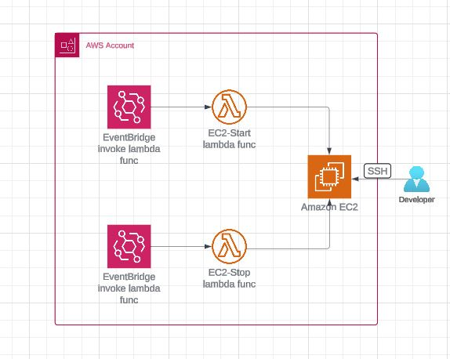
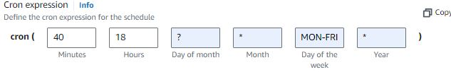
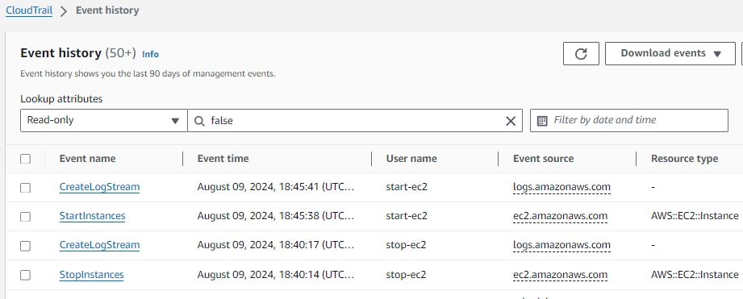

<h2>Schedule Your EC2 with Lambda and EventBridge</h2>

### ARCHITECTURE

### AWS services and Tools
* EC2
* Lambda (Python)
* EventBridge

### Steps taken to implement this architecture
1. Create an EC2 instance.
2. Create an IAM policy and IAM role specifically for Lambda.
3. Write a Lambda function to stop the EC2 instance.
4. Write a Lambda function to start the EC2 instance.
5. Set up two separate events in EventBridge to trigger these Lambda functions.

## 1. Create an EC2 instance.
* Search for "EC2" in the search bar.
* Go to Instances > Launch instances.
* Name your EC2 instance.
* Select Ubuntu as your OS.
* Choose Proceed without a key pair (you do not need a key pair).
* Leave everything else as default.
* Click Launch instance.

## 2. Create an IAM policy and IAM role specifically for Lambda.
* Search for "IAM" in the AWS search bar.
* Select "Policies" from the left-hand menu.
* Click "Create policy".
* Switch from the "Visual" editor to the "JSON" editor.
* Replace the existing code with the provided JSON code below.
* Click "Next".
* Name your policy.
* Click "Create policy".

      {
          "Version": "2012-10-17",
          "Statement": [
              {
                  "Effect": "Allow",
                  "Action": [
                      "logs:CreateLogGroup",
                      "logs:CreateLogStream",
                      "logs:PutLogEvents"
                  ],
                  "Resource": "arn:aws:logs:*:*:*"
              },
              {
                  "Effect": "Allow",
                  "Action": [
                      "ec2:Start*",
                      "ec2:Stop*"
                  ],
                  "Resource": "*"
              }
          ]
      }

* To create a role for Lambda, start by clicking on "Roles" in the left-hand menu.
* Select "AWS service" as the trusted entity.
* Under "Use case," choose "Lambda".
* Click "Next".
* Search for and select the policy you just created.
* Click "Next".
* Name your role.
* Click "Create role".

## 3. Write a Lambda function to stop the EC2 instance.
* Search for "Lambda" in the AWS search bar.
* Click "Create function".
* Select "Author from scratch".
* Enter the name for your function (e.g., "stop-ec2").
* Choose "Python 3.12" or the latest version for the runtime.
* Under "Change default execution role," select "Use an existing role".
* In the "Existing role" dropdown, choose the role you created earlier.
* Click "Create function".
* In the Code source section, replace the existing code with the code provided below.

            import boto3
            region = 'us-east-1' #replace your region
            instances = ['id of the instance you just created']
            ec2 = boto3.client('ec2', region_name=region)
            
            def lambda_handler(event, context):
                ec2.stop_instances(InstanceIds=instances)
                print('stopped your instances: ' + str(instances))

* After that, deploy and test your Lambda function. If the test is successful, your running instance should stop.

## 4. Write a Lambda function to start the EC2 instance.
* In the Code source section, replace the existing code with the code provided below.

            import boto3
            region = 'us-east-1'
            instances = ['i-08ac5deb1da1bef5b']
            ec2 = boto3.client('ec2', region_name=region)
            
            def lambda_handler(event, context):
                ec2.start_instances(InstanceIds=instances)
                print('started your instances: ' + str(instances))

  * After that, deploy and test your Lambda function. If the test is successful, your stopped instance should start running.

## 5. Set up two separate events in EventBridge to trigger these Lambda functions.
* Search for "EventBridge" in the AWS search bar.
* Select "EventBridge Rule".
* Click "Create rule".
* Name your rule.
* Choose "Schedule".
* Continue in "EventBridge Schedule".
* Select "Recurring schedule".
* Choose "Cron-based schedule".
* Turn off "Flexible time window".
* Click "Next".
* For the target type, select "API".
* Choose "Template targets".
* Select "AWS Lambda".
* Pick the Lambda function you created to stop the instance.
* Click "Next".
* Leave everything as default in the "Settings" section.
* Click "Next", then Create schedule.
* Repeat the process to create a separate event that invokes the other Lambda function.
  
      
** Note: This cron expression will run at 6:18 PM, Monday through Friday, every month, every year.

* If you go to CloudTrail under "Event history," you'll see that EventBridge has invoked the Lambda function, and the EC2 instance has been stopped and started.
      
